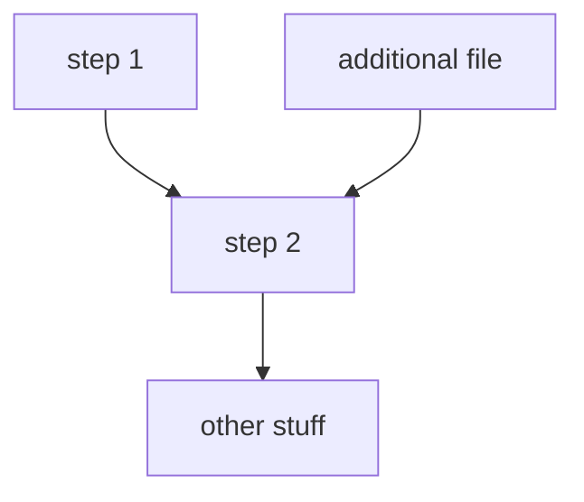

# Somalia UNFPA Census Support

## Description

Automating building detection in satellite imagery over Somalia, with a focus on Internally displaced people (IDPs).

## Workflow
Example, to be amended as required.



## Project structure tree
Successful running of the scripts assumes a certain structure in how where data and other auxiliary inputs need to be located.
The below tree demonstrates where each file/folder needs to be for successful execution.

```
📦somalia_unfpa_census_support
 ┣ 📂data
 ┣ 📂src
 ┣ 📜.gitignore
 ┗ 📜README.md
```

## Things of note
The [wiki page attached to this repo](https://github.com/datasciencecampus/somalia_unfpa_census_support/wiki/Somalia-UNFPA-Census-support) contains useful resources and other relevant notes.