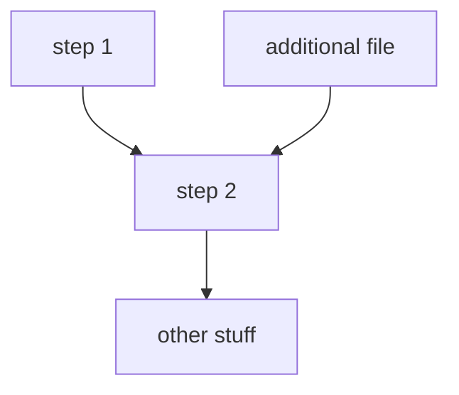

# Somalia UNFPA Census Support

## Description

Automating building detection in satellite imagery over Somalia, with a focus on Internally displaced people (IDPs).

## Workflow
Example, to be amended as required.



## Project structure tree
Successful running of the scripts assumes a certain structure in how where data and other auxiliary inputs need to be located.
The below tree demonstrates where each file/folder needs to be for successful execution or where files will be located following execution.

```
📦somalia_unfpa_census_support
 ┣ 📂data
 ┃ ┣ 📂IDP Priority Area Extent Shapefiles
 ┃ ┃ ┗ 📂IDP Priority Area Extent Shapefiles
 ┃ ┃ ┃ ┗ 📂IDP Survey Shapefiles
 ┃ ┃ ┃ ┃ ┣ 📜<areas>_Extent.cpg
 ┃ ┃ ┃ ┃ ┣ 📜<areas>_Extent.dbf
 ┃ ┃ ┃ ┃ ┣ 📜<areas>_Extent.prj
 ┃ ┃ ┃ ┃ ┣ 📜<areas>_Extent.shp
 ┃ ┃ ┃ ┃ ┣ 📜<areas>_Extent.shx
 ┃ ┣ 📂planet_images
 ┃ ┃ ┣ 📂Baidoa
 ┃ ┃ ┃ ┣ 📂Baidoa_NE_61MB_20220324
 ┃ ┃ ┃ ┣ 📂Baidoa_N_43MB_20221125
 ┃ ┃ ┃ ┣ 📂Baidoa_SW_107MB_20221125
 ┃ ┃ ┃ ┣ 📂Baidoa_S_66MB_20220324
 ┃ ┃ ┃ ┣ 📜Baidoa_NE_61MB_20220324.zip
 ┃ ┃ ┃ ┣ 📜Baidoa_N_43MB_20221125.zip
 ┃ ┃ ┃ ┣ 📜Baidoa_SW_107MB_20221125.zip
 ┃ ┃ ┃ ┗ 📜Baidoa_S_66MB_20220324.zip
 ┃ ┃ ┣ 📂Beletweyne
 ┃ ┃ ┃ ┣ 📂Beletweyne_45MB_20220818
 ┃ ┃ ┃ ┗ 📜Beletweyne_45MB_20220818.zip
 ┃ ┃ ┗ 📂Doolow
 ┃ ┃ ┃ ┣ 📂Dolow_E_95MB_20220830
 ┃ ┃ ┃ ┣ 📂Doolow_W_50MB_20221101
 ┃ ┃ ┃ ┣ 📜Dolow_E_95MB_20220830.zip
 ┃ ┃ ┃ ┣ 📜Doolow_W_50MB_20221101.zip
 ┃ ┣ 📂priority_areas_geojson
 ┃ ┃ ┣ 📜<area>_Extent.geojson
 ┃ ┣ 📂sentinel2_images
 ┃ ┃ ┣ 📂Doolow_S2
 ┃ ┃ ┃ ┗ 📂Doolow
 ┃ ┃ ┃ ┃ ┣ 📜Doolow_Extent_sentinel2_2022-08-15_2022-09-15.tif
 ┃ ┃ ┃ ┃ ┗ 📜Doolow_Extent_sentinel2_2022-10-15_2022-11-15.tif
 ┃ ┃ ┗ 📜Doolow_S2.zip
 ┃ ┗ 📜training_data.geojson
 ┣ 📂src
 ┃ ┣ 📜explore_imagery_and_data.py
 ┃ ┣ 📜functions_library.py
 ┃ ┣ 📜geospatial_util_functions.py
 ┃ ┣ 📜modelling_preprocessing.py
 ┃ ┣ 📜planet_img_processing_functions.py
 ┃ ┗ 📜sentinel_export_gee.py
 ┣ 📜.gitignore
 ┗ 📜README.md
 
```

## Things of note
The [wiki page attached to this repo](https://github.com/datasciencecampus/somalia_unfpa_census_support/wiki/Somalia-UNFPA-Census-support) contains useful resources and other relevant notes.
