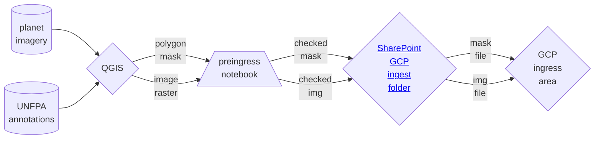
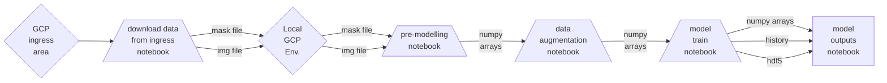

[](https://github.com/ambv/black)
[](https://github.com/GIScience/badges#experimental)

# Somalia UNFPA Census Support

## Description

UNet modelling of very high-resolution satellite imagery (0.5 m/px) to automate the detection of structures (tents, temporary structures, and buildings) in Somali Internally Displaced People (IDP) camps.

This project feeds into the work of UNFPA on census planning for the Somali Government. The outcomes would be building footprints, for IDP camps, fed into planning for enumeration areas.


## Workflow

Creation of Training Data

Modelling

## Training data

Follow the [wiki guide](https://github.com/datasciencecampus/somalia_unfpa_census_support/wiki/Using-QGIS-to-create-Training-Data) to create training data and export as `.geojson` files - using project naming structure:

`training_data_<area>_<unique int>_<your initials>`

>For validation data replace `training` with `validation`.

The training data needs to be processed and outputted as `.npy` files when first uploaded to GCP. This is done in the `premodelling_notebook.py`.

## Getting set-up (GCP):

This project is being developed in Google Cloud Platform (GCP), and so instructions are specific to this environment. A determined user can hopefully generalise these across other tools.

Users should clone the repo within their personal GCP notebooks, which are accessed via the Vertex AI Workbench.


### Virtual environment
Once in the project space (i.e. the base repository level) it is recommended you set-up a virtual environment. In the terminal run:
```
python3 -m venv venv-somalia-gcp
```
Next, to activate your virtual environment run
```
source venv-somalia-gcp/bin/activate
```

### Install dependencies
While in your active virtual environment, perform a pip install of the `requirements.txt` file, which lists the required dependencies. To do this run:
```
pip install -r requirements.txt
```

### Set-up custom kernel from your virtual environment
To access your installed packages from your virtual environment you need to set-up an ipython kernel from your environment. By default, the notebooks in GCP will access the base python. To set-up a custom kernel, ensure your virtual enivronment is active and from the terminal run:
```
ipython kernel install --name "venv-somalia-gcp" --user
```

After some possible delay, the kernel should appear in the list of kernels available in the top right corner of your notebooks.

### A note on Jupyter notebooks and Jupytext
Notebooks in this project are stored as `.py` files with a hookup via Jupytext, to ensure proper version control. The notebooks are distinguishable from modular python scripts via the following comments at their beginning:
```
# jupyter:
#   jupytext:
#     formats: ipynb,py:percent
```
After cloning the repository, from your terminal run:
```
jupytext --to notebook <file_name>.py
```
This will render a `.ipynb` file from the `.py` file. These two files are then synched together, such that any changes made to one will automatically update the other. This allows you to work and develop in a notebook, while avoiding the challenges and security threats that notebooks introduce in version control in terms of tracking changes and commiting outputs.

Note ensure ` jupytext_version: 1.14.5` for syncing across the project.

### Pre-commit actions
This repository makes use of [pre-commit hooks](https://towardsdatascience.com/getting-started-with-python-pre-commit-hooks-28be2b2d09d5). If approaching this project as a developer, you can install and enable `pre-commit` by running the following in your shell:
   1. Install `pre-commit`: within your active virtual/conda environment, run

      ```
      pip install pre-commit
      ```
   2. Enable `pre-commit`: Ensure you at the base repository level and run

      ```
      pre-commit install
      ```
Once pre-commits are activated, whenever you commit to this repository a series of checks will be excuted. The pre-commits include checking for security keys, large files, unresolved merge conflict headers and will also automatically format the code to an agreed standard. The use of active pre-commits are highly encouraged when working with this codebase.

*NOTE:* When a pre-commit hook fails, it will often automatically make modifications to the files you are attempting to commit. However, the pre-commit set-up will not be able to correct all errors itself, so take note of any flagged issues and resolve these manually. In either event, the commit will not yet have been confirmed. You will be required to perform a `git add` and then redo the `git commit` in order to proceed (such as pushing to origin).

## Project structure tree
Successful running of the scripts assumes a certain structure in how where data and other auxiliary inputs need to be located.
The below tree demonstrates where each file/folder needs to be for successful execution or where files will be located following execution.

```
📦somalia_unfpa_census_support
 ┣ 📂data
 ┃ ┣ 📂training_data
 ┃ ┃ ┗ 📂img
 ┃ ┃ ┃ ┣ 📜training_data_<area>_<initial>.tif
 ┃ ┃ ┃ ┣ 📜training_data_<area>_<initial>.npy
 ┃ ┃ ┗ 📂mask
 ┃ ┃ ┃ ┣ 📜training_data_<area>_<initial>.geojson
 ┃ ┃ ┃ ┣ 📜training_data_<area>_<initial>.npy
 ┃ ┣ 📂validation_data
 ┃ ┃ ┗ 📂img
 ┃ ┃ ┃ ┣ 📜validation_data_<area>_<initial>.tif
 ┃ ┃ ┃ ┣ 📜validation_data_<area>_<initial>.npy
 ┃ ┃ ┗ 📂mask
 ┃ ┃ ┃ ┣ 📜validation_data_<area>_<initial>.geojson
 ┃ ┃ ┃ ┣ 📜validation_data_<area>_<initial>.npy
 ┣ 📂src
 ┃ ┣ 📜bucket_access_functions.py
 ┃ ┣ 📜bucket_export_notebook.py
 ┃ ┣ 📜bucket_eimport_notebook.py
 ┃ ┣ 📜data_augmentation_functions.py
 ┃ ┣ 📜download_data_from_ingress.py
 ┃ ┣ 📜functions_library.py
 ┃ ┣ 📜loss_functions.py
 ┃ ┣ 📜idp_map_notebook.py
 ┃ ┣ 📜image_processing_functions.py
 ┃ ┣ 📜mask_processing_functions.py
 ┃ ┣ 📜model_outputs_functions.py
 ┃ ┣ 📜model_outputs_notebook.py
 ┃ ┣ 📜model_train_notebook.py
 ┃ ┣ 📜multi_class_unet_model_build.py
 ┃ ┣ 📜preingress_notebook.py
 ┃ ┣ 📜premodelling_notebook.py
 ┃ ┣ 📜weight_functions.py
 ┣ 📜config.yaml
 ┣ 📜.gitignore
 ┣ 📜requirements.text
 ┗ 📜README.md

```
## Uploading data to GCP

Training data (polygon masks and image rasters) can only be uploaded to GCP by someone assigned to the project as a 'Data Ingestor'. All data should be run locally through the `pre-ingress notebook`, and any issues resolved, before uploading to the project's [GCP SharePoint folder](https://officenationalstatistics.sharepoint.com/sites/dscdsc/Pro/Forms/AllItems.aspx?newTargetListUrl=%2Fsites%2Fdscdsc%2FPro&viewpath=%2Fsites%2Fdscdsc%2FPro%2FForms%2FAllItems%2Easpx&id=%2Fsites%2Fdscdsc%2FPro%2F2%2E%20Squads%2FInternational%5FDevelopment%2FData%20Science%20Projects%2F2%2E%20Data%20Science%20Research%20Projects%2FSomalia%5FUNFPA%5Fcensus%5Fsupport%2FData%2FGCP%20ingress%20folder&viewid=0d0e2855%2Dec81%2D4dab%2D8eb3%2D8a0d07ae59fe).

Ensure [this excel document has been updated](https://officenationalstatistics.sharepoint.com/:x:/r/sites/dscdsc/Pro/2.%20Squads/International_Development/Data%20Science%20Projects/2.%20Data%20Science%20Research%20Projects/Somalia_UNFPA_census_support/Data/GCP%20checklist.xlsx?d=w5547e56fcf0643b39cbee47411c8e886&csf=1&web=1&e=H5gNfg) after corresponding mask and img files have been run through the `pre-ingress notebook`.

When data is ready to be ingested to GCP, the Data Ingestor will encrypt the files and upload to the egress folder. Once past security checks data is moved to the ingress folder (automatic). Data can be downloaded from the ingress folder by running the `download data from ingress` notebook. Note that this notebook will delete all files, including `.npy`,  in the `training data` or `validation_data` subfolders as we currently have no ability to overwrite/delete files.


## Things of note
The [wiki page attached to this repo](https://github.com/datasciencecampus/somalia_unfpa_census_support/wiki/Somalia-UNFPA-Census-support) contains useful resources and other relevant notes.
