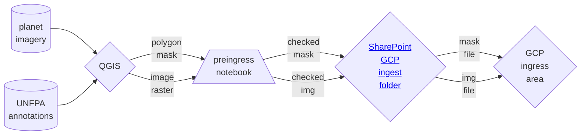
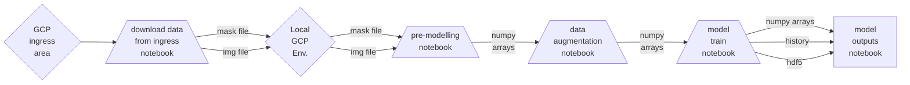

[](https://github.com/ambv/black)
[](https://github.com/GIScience/badges#experimental)

# Somalia UNFPA Census Support

## Background

Planning for a census requires understanding where populations are distributed so that enumeration areas can be successfully designed.

The last census in Somalia was 50 years ago, meaning that this data is no longer relevant for designing enumeration areas.

Instead, the Somali National Bureau of Statistics (SNBS) and the other Federal Member States inconjunction with the United Nations Population Fund (UNFPA) are looking to novel techniques to plan for the census in a resource-efficient way.

The [WorldPop pre-enumeration tool](https://www.worldpop.org/current-projects/completed-projects/exploring-the-automatic-pre-enumeration-areas-tool-for-surveys-on-forced-displacement-refugees/) is being used in a pilot for census mapping in Somalia. This phase is being funded by the Bill and Melinda Gates Foundation.

The pre-EA tool takes in multiple layers of data to design enumeration areas. It's estimated nearly 3 million people have been internally displaced in Somalia, seeking refugee in over 2,700 camps.

These camps change size and structure frequently due to external factors such as forced evictions from private lands, flooding, and camp re-organisation. Manually counting camp shelters from very high-resolution (VHR) satellite imagery is a time-consuing process. It would take 1 person 2 years to manually count all tents, a quarter of the way through they would need to start again.

The DSC at the ONS have automated the detection of shelters in Somali IDP camps. Combining UNet modelling with VHR Planet SkySat imagery (0.5m/px), shelters (tents and buildings) can be detected within minutes to a high degree of accuracy.


## How to use this repo
This repository has been specifically built for the purpose of training a multi-class UNet model to create shelters (tents and buildings) footprints for IDP camps in Somalia. The workflow also contains code to evaluate model outputs and run trained models on unseen imagery.

The workflow was built and optimised using Planet SkySat 0.5m/pixel imagery.

Training data consists of `geoTIF` image rasters with corresponding `geoJSON` masks of polygons. The masks have been manually created for this project. Both inputs are ~384 x 384 in size.

Code is written in python with the intention of being run in Jupyter notebooks.

The work was developed in Google Cloud Platform (GCP) infrastructure using a NVIDI T4 X 1 notebook with 16 vCPUs, 104 GB RAM, and 1 GPU.

GCP specific notebooks are highlighted below. All packages are provided in a `requirements.txt`, for a dedicated user to generalise this workflow in other environments.


## Workflow

Creation of Training Data

Model training


## Getting set-up (GCP):

Users should clone the repo within their personal GCP notebooks, which are accessed via the Vertex AI Workbench.


### Virtual environment
Once in the project space (i.e. the base repository level) it is recommended you set-up a virtual environment. In the terminal run:
```
python3 -m venv venv-somalia-gcp
```
Next, to activate your virtual environment run
```
source venv-somalia-gcp/bin/activate
```

### Install dependencies
While in your active virtual environment, perform a pip install of the `requirements.txt` file, which lists the required dependencies. To do this run:
```
pip install -r requirements.txt
```

### Set-up custom kernel from your virtual environment
To access your installed packages from your virtual environment you need to set-up an ipython kernel from your environment. By default, the notebooks in GCP will access the base python. To set-up a custom kernel, ensure your virtual enivronment is active and from the terminal run:
```
ipython kernel install --name "venv-somalia-gcp" --user
```

After some possible delay, the kernel should appear in the list of kernels available in the top right corner of your notebooks.


### Pre-commit actions
This repository makes use of [pre-commit hooks](https://towardsdatascience.com/getting-started-with-python-pre-commit-hooks-28be2b2d09d5). If approaching this project as a developer, you can install and enable `pre-commit` by running the following in your shell:
   1. Install `pre-commit`: within your active virtual/conda environment, run

      ```
      pip install pre-commit
      ```
   2. Enable `pre-commit`: Ensure you at the base repository level and run

      ```
      pre-commit install
      ```
Once pre-commits are activated, whenever you commit to this repository a series of checks will be excuted. The pre-commits include checking for security keys, large files, unresolved merge conflict headers and will also automatically format the code to an agreed standard. The use of active pre-commits are highly encouraged when working with this codebase.

*NOTE:* When a pre-commit hook fails, it will often automatically make modifications to the files you are attempting to commit. However, the pre-commit set-up will not be able to correct all errors itself, so take note of any flagged issues and resolve these manually. In either event, the commit will not yet have been confirmed. You will be required to perform a `git add` and then redo the `git commit` in order to proceed (such as pushing to origin).

### A note on Jupyter notebooks and Jupytext
Notebooks in this project are stored as `.py` files with a hookup via Jupytext, to ensure proper version control. The notebooks are distinguishable from modular python scripts via the following comments at their beginning:
```
# jupyter:
#   jupytext:
#     formats: ipynb,py:percent
```
After cloning the repository, from your terminal run:
```
jupytext --to notebook <file_name>.py
```
This will render a `.ipynb` file from the `.py` file. These two files are then synched together, such that any changes made to one will automatically update the other. This allows you to work and develop in a notebook, while avoiding the challenges and security threats that notebooks introduce in version control in terms of tracking changes and commiting outputs.

Note ensure ` jupytext_version: 1.14.5` for syncing across the project.

## Project structure tree
Successful running of the scripts assumes a certain structure in how where data and other auxiliary inputs need to be located.
The below tree demonstrates where each file/folder needs to be for successful execution or where files will be located following execution.

### Overview
```
📦somalia_unfpa_census_support
 ┣ 📂data
 ┣ 📂models
 ┣ 📂outputs
 ┣ 📂src
 ┣ 📂venv-somalia-gcp
 ┣ 📜config.yaml
 ┣ 📜.gitignore
 ┣ 📜requirements.text
 ┗ 📜README.md

```
### Data
```
📦somalia_unfpa_census_support
 ┣ 📂data
 ┃ ┣ 📂camp_tiles
 ┃ ┃ ┗ 📂baidoa
 ┃ ┣ 📂footprints
 ┃ ┃ ┗ 📜<area>_<sub_area>.geojson
 ┃ ┣ 📂outputs
 ┃ ┣ 📂training
 ┃ ┃ ┣ 📂json_dir
 ┃ ┃ ┃  ┗ 📜t<data_type>_features_dict.json
 ┃ ┃ ┣ 📂training_data
 ┃ ┃ ┃  ┣ 📂img
 ┃ ┃ ┃  ┃   ┣ 📜training_data_<area>_<initial>.tif
 ┃ ┃ ┃  ┃   ┗ 📜training_data_<area>_<initial>.npy
 ┃ ┃ ┃  ┣ 📂mask
 ┃ ┃ ┃  ┃   ┣ 📜training_data_<area>_<initial>.geojson
 ┃ ┃ ┃  ┃   ┗ 📜training_data_<area>_<initial>.npy
 ┃ ┃ ┣ 📂validation_data
 ┃ ┃ ┃  ┣ 📂img
 ┃ ┃ ┃  ┃   ┣ 📜validation_data_<area>_<initial>.tif
 ┃ ┃ ┃  ┃   ┗ 📜validation_data_<area>_<initial>.npy
 ┃ ┃ ┃  ┣ 📂mask
 ┃ ┃ ┃  ┃   ┣ 📜validation_data_<area>_<initial>.geojson
 ┃ ┃ ┃  ┃   ┗ 📜validation_data_<area>_<initial>.npy
 ┃ ┃ ┣ 📂ramp_bentiu_south_sudan
 ┃ ┃ ┃  ┣ 📂img
 ┃ ┃ ┃  ┃   ┣ 📜ramp_bentiu_south_sudan_<area>_<initial>.tif
 ┃ ┃ ┃  ┃   ┗ 📜vramp_bentiu_south_sudan_<area>_<initial>.npy
 ┃ ┃ ┃  ┣ 📂mask
 ┃ ┃ ┃  ┃   ┣ 📜ramp_bentiu_south_sudan_<area>_<initial>.geojson
 ┃ ┃ ┃  ┃   ┗ 📜ramp_bentiu_south_sudan_<area>_<initial>.npy
 ┃ ┃ ┣ 📂stacked_arrays
 ┃ ┃ ┃  ┣ 📂img
 ┃ ┃ ┃  ┃   ┣ 📜<data_type>_all_stacked_images.npy
 ┃ ┃ ┃  ┃   ┗ 📜<data_type>_all_stacked_filenames.npy
 ┃ ┃ ┃  ┣ 📂mask
 ┗ ┗ ┗  ┗   ┗ 📜<data_type>_all_stacked_masks.npy

```
### Code
```
📦somalia_unfpa_census_support
 ┣ 📂src
 ┃ ┣ 📜1_premodelling_notebook.py
 ┃ ┣ 📜2_data_augmentation_notebook.py
 ┃ ┣ 📜3_model_train_notebook.py
 ┃ ┣ 📜4_model_outputs_notebook.py
 ┃ ┣ 📜5_model_run_evaluation.py
 ┃ ┣ 📜bucket_access_functions.py
 ┃ ┣ 📜bucket_export_notebook.py
 ┃ ┣ 📜bucket_import_notebook.py
 ┃ ┣ 📜create_footprints.py
 ┃ ┣ 📜create_footprints_functions.py
 ┃ ┣ 📜create_input_tiles.py
 ┃ ┣ 📜data_augmentation_functions.py
 ┃ ┣ 📜download_from_bucket.py
 ┃ ┣ 📜functions_library.py
 ┃ ┣ 📜loss_functions.py
 ┃ ┣ 📜idp_map_notebook.py
 ┃ ┣ 📜image_processing_functions.py
 ┃ ┣ 📜mask_processing_functions.py
 ┃ ┣ 📜model_outputs_functions.py
 ┃ ┣ 📜multi_class_unet_model_build.py
 ┃ ┣ 📜preingress_notebook.py
 ┃ ┣ 📜weight_functions.py
 ┣ 📜config.yaml
 ┣ 📜.gitignore
 ┣ 📜requirements.text
 ┗ 📜README.md

```

## Data

### Training data

Follow the [wiki guide](https://github.com/datasciencecampus/somalia_unfpa_census_support/wiki/Using-QGIS-to-create-Training-Data) to create training data. Image rasters should be exported as `.geoTIF` and accompanying polygons and as `.geoJSON` files.

Use the project naming structure:

`training_data_<area>_<unique int>_<your initials>`

>For validation data replace `training` with `validation`.


### Uploading data to GCP

All data should be run locally through the `pre-ingress notebook`, and any issues resolved, before uploading to the project's [GCP SharePoint folder](https://officenationalstatistics.sharepoint.com/sites/dscdsc/Pro/Forms/AllItems.aspx?newTargetListUrl=%2Fsites%2Fdscdsc%2FPro&viewpath=%2Fsites%2Fdscdsc%2FPro%2FForms%2FAllItems%2Easpx&id=%2Fsites%2Fdscdsc%2FPro%2F2%2E%20Squads%2FInternational%5FDevelopment%2FData%20Science%20Projects%2F2%2E%20Data%20Science%20Research%20Projects%2FSomalia%5FUNFPA%5Fcensus%5Fsupport%2FData%2FGCP%20ingress%20folder&viewid=0d0e2855%2Dec81%2D4dab%2D8eb3%2D8a0d07ae59fe).

When data is ready to be ingested to GCP, the files can be drag and dropped into the [ingress bucket](https://console.cloud.google.com/storage/browser/somalia-census-support-ingress;tab=objects?forceOnBucketsSortingFiltering=true&project=somalia-census-support&prefix=&forceOnObjectsSortingFiltering=false):

`somalia-census-support-ingress`

Note the directory structure, which mirrors that of local GCP (shown above).

### Moving data to local GCP storage

To download files from the ingress bucket into the local GCP environment run the `download_from_bucket.py` script with the below line:

```
python src/download_from_bucket.py gs://somalia-census-support-ingress/training/ data/training/
```

### Moving data from local GCP storage

To upload files from local storage into the egress bucket run the `upload_to_bucket.py` script with the below line:
```
python src/upload_to_bucket.py data/outputs/figures gs://somalia-census-egress/
```

## Things of note
The [wiki page attached to this repo](https://github.com/datasciencecampus/somalia_unfpa_census_support/wiki/Somalia-UNFPA-Census-support) contains useful resources and other relevant notes.
