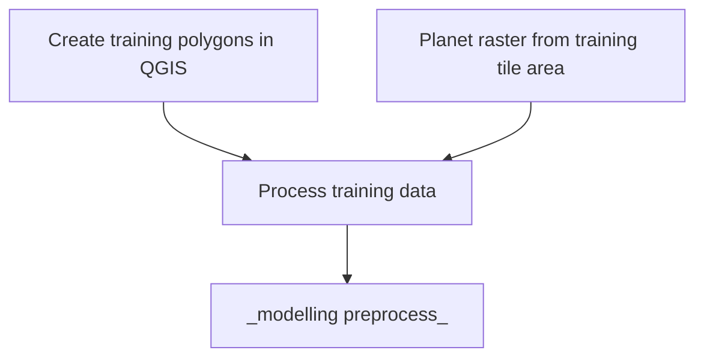

[](https://github.com/ambv/black)
[](https://github.com/GIScience/badges#experimental)

# Somalia UNFPA Census Support

## Description

Automating building detection in satellite imagery over Somalia, with a focus on Internally displaced people (IDPs).

## Getting set-up (GCP):

This project uses GCP for development, so these instructions are talloired to the platform. But a determined user can hopefully generalise these across over tools. 

### Virtual environments
Once in the project space (i.e. the base repository level) it is recommended you set-up a virtual environment. To do this run:
```
python3 -m venv <your-chosen-environment-name>
```
Next, to activate your virtual environment run 
```
source <your-chosen-environment-name>/bin/activate
```

### Install dependencies
While in your active virtual environment, perform a pip install of the `requirements.txt` file, which lists the required dependencies. To do this run:
```
pip install -r requirements.txt
```

### Set-up custom kernel from your virtual environment
To access your installed packages from your virtual environment you need to set-up an ipython kernel from your environment. By default, the notebooks in GCP will access the base python. To set-up a custom kernel, ensure your virtual enivronment is active and from the terminal run: 
```
ipython kernel install --name "<your-chosen-environment-name>" --user
``` 
(e.g. with a virtual environment called `somalia-env` run ```ipython kernel install --name "somalia-env" --user```). 

After some possible delay, the kernel should appear in the list of kernels available in the top right corner of your notebooks. 

### A note on Notebooks and Jupytext
For the benefit of proper version control, any notebooks in this project are stored as `.py` files with a hookup via Jupytext. The notebooks are distinguishable from modular python scripts via the following comments at their beginning:
```
# ---
# jupyter:
#   jupytext:
#     formats: ipynb,py:percent
....
```
In order to successfully use these as notebooks, you are required to have [Jupytext](https://jupytext.readthedocs.io/en/latest/install.html) installed (which can be achieved via a pip or conda install). After cloning the repository, run
```
jupytext --to notebook <file_name>.py
```
from your terminal. This will render a `.ipynb` file from the `.py` file. These two files are then synched together, such that any changes made to one will automatically update the other. This allows you to work and develop in a notebook, while avoiding the challenges and security threats that notebooks introduce in version control in terms of tracking changes and commiting outputs.


### Pre-commit actions
This repository makes use of [pre-commit hooks](https://towardsdatascience.com/getting-started-with-python-pre-commit-hooks-28be2b2d09d5). If approaching this project as a developer, you can install and enable `pre-commit` by running the following in your shell:
   1. Install `pre-commit`: within your active virtual/conda environment, run

      ```
      pip install pre-commit
      ```
   2. Enable `pre-commit`: Ensure you at the base repository level and run

      ```
      pre-commit install
      ```
Once pre-commits are activated, whenever you commit to this repository a series of checks will be excuted. The pre-commits include checking for security keys, large files, unresolved merge conflict headers and will also automatically format the code to an agreed standard. The use of active pre-commits are highly encouraged when working with this codebase.

*NOTE:* When a pre-commit hook fails, it will often automatically make modifications to the files you are attempting to commit. However, the pre-commit set-up will not be able to correct all errors itself, so take note of any flagged issues and resolve these manually. In either event, the commit will not yet have been confirmed. You will be required to perform a `git add` and then redo the `git commit` in order to proceed (such as pushing to origin).

## Project structure tree
Successful running of the scripts assumes a certain structure in how where data and other auxiliary inputs need to be located.
The below tree demonstrates where each file/folder needs to be for successful execution or where files will be located following execution.

```
📦somalia_unfpa_census_support
 ┣ 📂data
 ┃ ┣ 📂training_data
 ┃ ┃ ┗ 📂img
 ┃ ┃ ┃ ┣ 📜training_data_<area>_<initial>.tif
  ┃ ┃ ┃ ┣ 📜training_data_<area>_<initial>.npy
 ┃ ┃ ┗ 📂mask
  ┃ ┃ ┃ ┣ 📜training_mask_<area>_<initial>.shp
   ┃ ┃ ┃ ┣ 📜training_mask_<area>_<initial>.npy
 ┣ 📂src
 ┃ ┣ 📜explore_imagery_and_data.py
 ┃ ┣ 📜functions_library.py
 ┃ ┣ 📜geospatial_util_functions.py
 ┃ ┣ 📜modelling_preprocessing.py
 ┃ ┣ 📜planet_img_processing_functions.py
 ┃ ┗ 📜training_data_preprocessing_notebook.py
 ┣ 📜.gitignore
 ┗ 📜README.md

```

## Workflow

_in progress_




## Training data

The training data only needs to be processed and outputted when first derived, or if changes are made to the polygons/raster. Follow the wiki guide to create training data and export as `.shp` files.

Follow the steps in the notebook - making sure to change the input file names and the outputted file names (_better solution needed eventually_). This notebook will convert the training data into numpy binary outputs that can be handled in an environment without geospatial packages present.


## Things of note
The [wiki page attached to this repo](https://github.com/datasciencecampus/somalia_unfpa_census_support/wiki/Somalia-UNFPA-Census-support) contains useful resources and other relevant notes.
