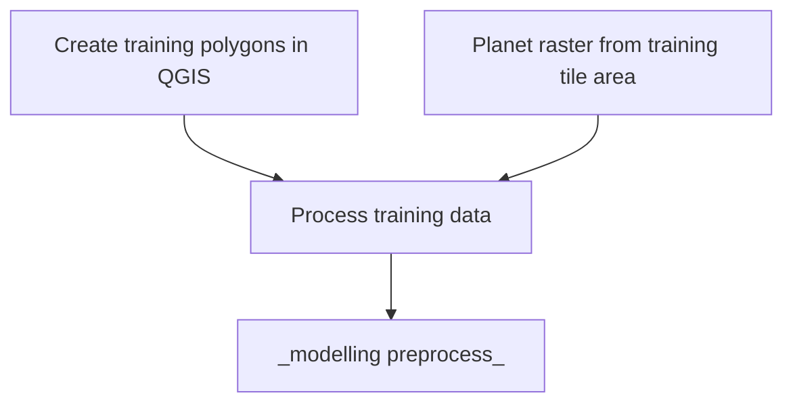

# Somalia UNFPA Census Support

## Description

Automating building detection in satellite imagery over Somalia, with a focus on Internally displaced people (IDPs).

## Getting set-up:

### Notebooks and Jupytext
For the benefit of proper version control, any notebooks in this project are stored as `.py` files with a hookup via Jupytext. The notebooks are distinguishable from modular python scripts via the following comments at their beginning:
```
# ---
# jupyter:
#   jupytext:
#     formats: ipynb,py:percent
....
```
In order to successfully use these as notebooks, you are required to have [Jupytext](https://jupytext.readthedocs.io/en/latest/install.html) installed (which can be achieved via a pip or conda install). After cloning the repository, run
```
jupytext --to notebook <file_name>.py
```
from your terminal. This will render a `.ipynb` file from the `.py` file. These two files are then synched together, such that any changes made to one will automatically update the other. This allows you to work and develop in a notebook, while avoiding the challenges and security threats that notebooks introduce in version control in terms of tracking changes and commiting outputs.

Note you will want to sync your `.ipynb` files to your conda environment either via ipykernel:

```
conda install -c anaconda ipykernel
````
then
```
python -m ipykernel install --user --name=myenv
```
and then selecting the relevant ipykernel on the notebook start-up.
Or you can open jupyter notebook from your environment:
```
jupyter notebook
```

### Pre-commit actions
This repository makes use of [pre-commit hooks](https://towardsdatascience.com/getting-started-with-python-pre-commit-hooks-28be2b2d09d5). If approaching this project as a developer, you can install and enable `pre-commit` by running the following in your shell:
   1. Install `pre-commit`: within your active virtual/conda environment, run

      ```
      pip install pre-commit
      ```
   2. Enable `pre-commit`: Ensure you at the base repository level and run

      ```
      pre-commit install
      ```
Once pre-commits are activated, whenever you commit to this repository these will be excuted. The pre-commits include checking for security keys, large files, unresolved merge conflict headers and will also automatically format the code to an agreed standard. The use of active pre-commits are highly encouraged when working with this codebase.

*NOTE:* Pre-commit hooks will often automatically make modifications to the files you are attempting to commit. When this happens, the commit will not have been confirmed. You will be required to perform a `git add` and then redo the `git commit` in order to proceed.

## Project structure tree
Successful running of the scripts assumes a certain structure in how where data and other auxiliary inputs need to be located.
The below tree demonstrates where each file/folder needs to be for successful execution or where files will be located following execution.

```
📦somalia_unfpa_census_support
 ┣ 📂data
 ┃ ┣ 📂IDP Priority Area Extent Shapefiles
 ┃ ┃ ┗ 📂IDP Priority Area Extent Shapefiles
 ┃ ┃ ┃ ┗ 📂IDP Survey Shapefiles
 ┃ ┃ ┃ ┃ ┣ 📜<areas>_Extent.cpg
 ┃ ┃ ┃ ┃ ┣ 📜<areas>_Extent.dbf
 ┃ ┃ ┃ ┃ ┣ 📜<areas>_Extent.prj
 ┃ ┃ ┃ ┃ ┣ 📜<areas>_Extent.shp
 ┃ ┃ ┃ ┃ ┣ 📜<areas>_Extent.shx
 ┃ ┣ 📂planet_images
 ┃ ┃ ┣ 📂Baidoa
 ┃ ┃ ┃ ┣ 📂Baidoa_NE_61MB_20220324
 ┃ ┃ ┃ ┣ 📂Baidoa_N_43MB_20221125
 ┃ ┃ ┃ ┣ 📂Baidoa_SW_107MB_20221125
 ┃ ┃ ┃ ┣ 📂Baidoa_S_66MB_20220324
 ┃ ┃ ┃ ┣ 📜Baidoa_NE_61MB_20220324.zip
 ┃ ┃ ┃ ┣ 📜Baidoa_N_43MB_20221125.zip
 ┃ ┃ ┃ ┣ 📜Baidoa_SW_107MB_20221125.zip
 ┃ ┃ ┃ ┗ 📜Baidoa_S_66MB_20220324.zip
 ┃ ┃ ┣ 📂Beletweyne
 ┃ ┃ ┃ ┣ 📂Beletweyne_45MB_20220818
 ┃ ┃ ┃ ┗ 📜Beletweyne_45MB_20220818.zip
 ┃ ┃ ┗ 📂Doolow
 ┃ ┃ ┃ ┣ 📂Dolow_E_95MB_20220830
 ┃ ┃ ┃ ┣ 📂Doolow_W_50MB_20221101
 ┃ ┃ ┃ ┣ 📜Dolow_E_95MB_20220830.zip
 ┃ ┃ ┃ ┣ 📜Doolow_W_50MB_20221101.zip
 ┃ ┣ 📂priority_areas_geojson
 ┃ ┃ ┣ 📜<area>_Extent.geojson
 ┃ ┣ 📂Training_Data_Doolow
 ┃ ┃ ┣ 📜Doolow east and west training data.qgz
 ┃ ┃ ┣ 📜training_data_<area_number>.shp
 ┃ ┃ ┣ 📜training_data_<area_number>_extent.shp
 ┃ ┃ ┣ 📜training_data_<area_number>.tif
 ┣ 📂src
 ┃ ┣ 📜explore_imagery_and_data.py
 ┃ ┣ 📜functions_library.py
 ┃ ┣ 📜geospatial_util_functions.py
 ┃ ┣ 📜modelling_preprocessing.py
 ┃ ┣ 📜planet_img_processing_functions.py
 ┃ ┗ 📜training_data_preprocessing_notebook.py
 ┣ 📜.gitignore
 ┗ 📜README.md

```

## Workflow

_in progress_




## Training data

The training data only needs to be processed and outputted when first derived, or if changes are made to the polygons/raster. Follow the wiki guide to create training data and export as `.shp` files.

Create your geospatial conda environment:

```
conda create -n environment-geo.yml
```

then activate the environment:

```
conda activate somalia-geo
```

Convert the `training_data_processing_notebook.py` file into a `.ipynb` as shown above, and open the notebook in your conda environment.

Follow the steps in the notebook - making sure to change the input file names and the outputted file names (_better solution needed eventually_). This notebook will convert the training data into numpy binary outputs that can be handled in an environment without geospatial packages present.


## Things of note
The [wiki page attached to this repo](https://github.com/datasciencecampus/somalia_unfpa_census_support/wiki/Somalia-UNFPA-Census-support) contains useful resources and other relevant notes.
