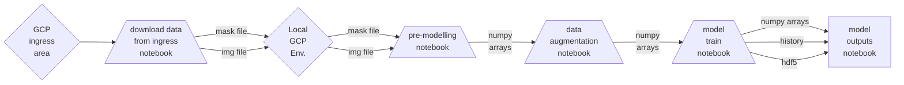

# Cloud Platform README

## This README contains information on using certain aspects of this repository with a cloud platform

## Workflow

Model training

### Overview
```
📦somalia_unfpa_census_support
 ┣ 📂data
 ┣ 📂models
 ┣ 📂outputs
 ┣ 📂src
 ┣ 📂venv-somalia-gcp
 ┣ 📜config.yaml
 ┣ 📜.gitignore
 ┣ 📜requirements.text
 ┗ 📜README.md

```

### Code
```
📦somalia_unfpa_census_support
 ┣ 📂src
 ┃ ┗ 📂cloud
 ┃    ┣ 📜1_cloud_premodelling_notebook.py
 ┃    ┣ 📜2_cloud_data_augmentation_notebook.py
 ┃    ┣ 📜3_cloud_model_train_notebook.py
 ┃    ┣ 📜4_cloud_model_outputs_notebook.py
 ┃    ┣ 📜5_cloud_model_run_evaluation.py
 ┃    ┣ 📜cloud_bucket_access_functions.py
 ┃    ┣ 📜cloud_bucket_export_notebook.py
 ┃    ┣ 📜cloud_bucket_import_notebook.py
 ┃    ┣ 📜cloud_create_footprints.py
 ┃    ┣ 📜cloud_create_footprints_functions.py
 ┃    ┣ 📜cloud_create_input_tiles.py
 ┃    ┣ 📜cloud_data_augmentation_functions.py
 ┃    ┣ 📜cloud_download_from_bucket.py
 ┃    ┣ 📜cloud_functions_library.py
 ┃    ┣ 📜cloud_loss_functions.py
 ┃    ┣ 📜cloud_idp_map_notebook.py
 ┃    ┣ 📜cloud_image_processing_functions.py
 ┃    ┣ 📜cloud_mask_processing_functions.py
 ┃    ┣ 📜cloud_model_outputs_functions.py
 ┃    ┣ 📜cloud_multi_class_unet_model_build.py
 ┃    ┗ 📜cloud_weight_functions.py
 ┣ 📜config.yaml
 ┣ 📜.gitignore
 ┣ 📜requirements.text
 ┗ 📜README.md

```
